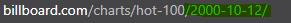
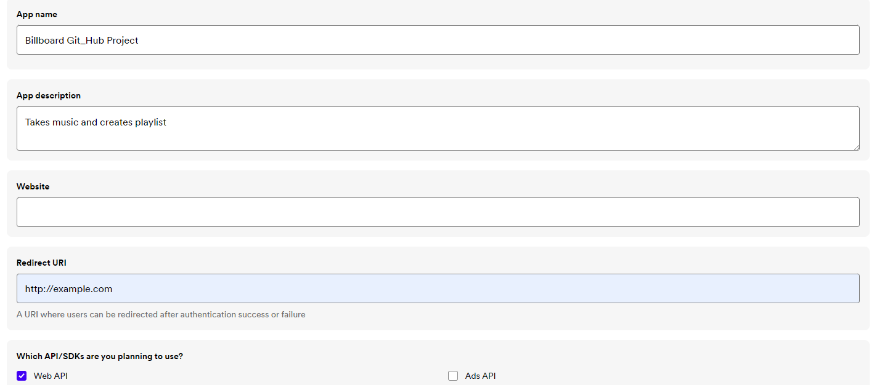

In this project we get the top 100 songs from
a date

the highlighted text is the date in the format YYYY-MM-DD

Step 1: We scrape the names of the songs and artists using beautiful soup
-

Step 2: We start our Spotify Journey 
-
-We go to : https://developer.spotify.com/dashboard/create             
You may need to verify your email address.(Assuming you already have an account. If not please create one, spotify has tons of cool playlists and podcasts you're missing out.)

Then you proceed to create an app to get  Client ID and Client Secret keys.
Once you get them save them in your file directly or save them as environmental variables and then access them with 'os' and 'dotenv', look at this link if you have no experience in doing this: https://stackoverflow.com/questions/42708389/how-to-set-environment-variables-in-pycharm

Next we need to take our token. You need to do a post request like this: 
spotify_token = requests.post("https://accounts.spotify.com/api/token",
                              headers=headers,
                              data=client_data
                              )

After that you'll be able to see a .cache file with your access token inside

After we use a function to get all our URI(unique for each track) we proceed to create and add the songs to a playlist

Step 3 The Playlist
-
First we start by getting the user id using the access token. VERY IMPORTANT: The access token last ony 1 hour, when you first run the code you get a .cache file created with the access token and the refresh token. If the access token is expired use the refresh token. I solved the 'unauthorized' response this way 

Step 4 Adding Tracks
-
We add the tracks to our playlist and we start listening :) 